# GRAPHINTEL — Market Intelligence GraphRAG Platform

<div align="center">


<p align="center">
  <strong>Production-oriented Market Intelligence platform powering multi-format document ingestion, semantic vector retrieval, and grounded RAG with verifiable citations.</strong>
</p>

[Architecture](docs/architecture.md) • [Ingestion Pipeline](docs/ingestion.md) • [RAG Engine](docs/rag.md) • [API Reference](docs/api.md)

</div>

---

## Overview

**GraphIntel** is an enterprise market research and document intelligence platform. It ingests complex financial filings, broker research, earnings call transcripts, and corporate disclosures, converting them into clean vector-indexed chunks for verifiable, grounded RAG with real citations.

> **Implementation Scope:** This codebase implements **Phase 1 (Foundation & Architecture)**, **Phase 2 (Document Ingestion Pipeline)**, and **Phase 3 (Baseline Vector RAG System)**. All provider interfaces are decoupled so **Phase 4 (Neo4j Knowledge Graph)** and **Phase 5 (Hybrid GraphRAG)** can be incorporated without rewrites.

---

## Architecture Diagram

```mermaid
graph TB
    subgraph Client ["Frontend Layer (Next.js 14 + Tailwind CSS)"]
        UI_Dash["Executive Dashboard (/dashboard)"]
        UI_Docs["Filing Ingestion & Chunks (/documents)"]
        UI_Inspect["Chunk Inspector (/documents/:id)"]
        UI_Chat["Research Assistant (/chat)"]
    end

    subgraph API_Gateway ["Backend Gateway (FastAPI 0.110+)"]
        AuthRoute["Auth Router (/api/v1/auth)"]
        DocRoute["Documents Router (/api/v1/documents)"]
        QueryRoute["Query Router (/api/v1/query)"]
        HealthRoute["Health Router (/api/v1/health)"]
    end

    subgraph CoreServices ["Core Services"]
        IngestSvc["IngestionService"]
        TextProc["TextProcessor"]
        Chunker["DocumentChunker (tiktoken)"]
        RetrSvc["RetrievalService"]
        RAGSvc["RAGService (Prompt-Injection Guard)"]
    end

    subgraph Providers ["Decoupled Provider Interfaces"]
        StorageP["StorageProvider\n(MinIO / LocalDisk)"]
        ParserP["DocumentParser\n(PDF/DOCX/HTML/TXT/CSV/JSON)"]
        EmbedP["EmbeddingProvider\n(OpenAI / Local 384d)"]
        VectP["VectorStore\n(Qdrant / InMemory)"]
        LLMP["LLMProvider\n(OpenAI / Ollama / Mock)"]
    end

    subgraph Storage ["Infrastructure & Persistence"]
        Postgres[(PostgreSQL 16\nSQLAlchemy 2.0 & Alembic)]
        MinIO[(MinIO Object Storage\nRaw Filings)]
        Qdrant[(Qdrant Vector DB\nCosine Embeddings)]
    end

    Client --> API_Gateway
    API_Gateway --> CoreServices
    CoreServices --> Providers
    Providers --> Storage
```



---

## Key Features

### Phase 1: Foundation & Architecture
* **Modular Backend**: FastAPI application with API versioning (`/api/v1/...`), Pydantic v2 schemas, and dependency injection.
* **Security & Auth**: JWT authentication (HS256), bcrypt password hashing, and user ownership isolation on all endpoints.
* **Database & Migrations**: PostgreSQL with SQLAlchemy 2.0 async ORM and version-controlled Alembic migrations.
* **Observability & Resilience**: Structured JSON logging with `request_id` correlation and uniform error models (400, 401, 403, 404, 413, 422, 429, 500) preventing stack trace leakage.
* **System Health API**: `GET /api/v1/health` verifying live connectivity across PostgreSQL, MinIO, and Qdrant.

### Phase 2: Document Ingestion Pipeline
* **Multi-Format Parsers**:
  * **PDF**: PyMuPDF (`fitz`) page-by-page extraction preserving page numbers and document titles.
  * **DOCX**: `python-docx` headings, paragraphs, and tabular records.
  * **HTML**: `BeautifulSoup4` tag sanitization, title resolution, and clean structural DOM extraction.
  * **TXT**: Robust encoding fallbacks (UTF-8, Latin-1, CP1252) with paragraph grouping.
  * **CSV**: `pandas` dataset overview, column indexing, and row-batch semantic descriptions.
  * **JSON**: Hierarchical structured key-value extraction and array batching.
* **Text Processing**: Canonical NFKC unicode normalization, whitespace collapsing, and paragraph break preservation.
* **Sentence & Paragraph-Aware Chunking**: Configurable `CHUNK_SIZE` (1000 tokens) and `CHUNK_OVERLAP` (200 tokens) with `tiktoken` (`cl100k_base`) token counting.
* **Storage Abstraction**: `StorageProvider` interface with MinIO object storage and local filesystem fallback.

### Phase 3: Baseline Vector RAG System
* **Provider Abstractions**:
  * `EmbeddingProvider`: OpenAI `text-embedding-3-small` (batched) and deterministic `LocalDeterministicEmbeddingProvider` (384d, zero API key needed for local offline tests).
  * `VectorStore`: `QdrantVectorStore` (with tenant user_id filtering) and `InMemoryVectorStore`.
  * `LLMProvider`: OpenAI (`gpt-4o-mini`), Ollama (`llama3:8b`), and deterministic `MockLLMProvider`.
* **Prompt Injection Defense**: All context wrapped in explicit untrusted data delimiters (`<document_data>`) with system instructions to treat malicious text as passive data.
* **Real Citation Mapping**: Answers reference exact retrieved chunks `[1]`, `[2]` with document ID, filename, page number, chunk ID, and similarity score.
* **Query Latency Telemetry**: Every query returns precise `retrieval_time_ms`, `llm_time_ms`, and `total_time_ms`.

### Frontend Web Application
* **Next.js 14 App Router + Tailwind CSS**: Dark obsidian executive theme with glassmorphic cards and responsive navigation.
* **Live Dashboard (`/dashboard`)**: Metric cards for Total, Processing, Completed, and Failed filings, plus a recent filings table.
* **Document Manager (`/documents`)**: Drag-and-drop file uploader, real-time status badges, and deletion.
* **Chunk Inspector (`/documents/[id]`)**: Detailed view of each parsed chunk, page number, section title, token count, and raw text.
* **Research Assistant (`/chat`)**: Interactive question-answering interface with citation cards, evidence drawer, and latency telemetry.

---

## Directory Structure

```text
GraphIntel/
├── backend/
│   ├── alembic/                      # Database migrations
│   │   ├── versions/
│   │   └── env.py
│   ├── app/
│   │   ├── api/v1/                   # FastAPI version 1 endpoints
│   │   │   ├── auth.py               # Register, login, current user
│   │   │   ├── documents.py          # Upload, list, status, chunks, delete
│   │   │   ├── health.py             # System health check
│   │   │   ├── query.py              # Semantic RAG query & history
│   │   │   └── router.py             # Aggregated router
│   │   ├── core/                     # Config, logging, exceptions
│   │   ├── db/                       # Engine, sessionmaker, init_models
│   │   ├── models/                   # SQLAlchemy 2.0 models
│   │   ├── providers/                # Decoupled vendor abstractions
│   │   │   ├── embeddings/           # OpenAI, Local Deterministic
│   │   │   ├── llm/                  # OpenAI, Ollama, Mock
│   │   │   ├── parsers/              # PDF, DOCX, HTML, TXT, CSV, JSON
│   │   │   ├── storage/              # MinIO, LocalDisk
│   │   │   └── vector_store/         # Qdrant, InMemory
│   │   ├── schemas/                  # Pydantic v2 validation models
│   │   ├── services/                 # Chunker, Ingestion, Retrieval, RAG
│   │   └── main.py                   # FastAPI application entrypoint
│   ├── tests/                        # 19 comprehensive unit & integration tests
│   ├── Dockerfile
│   ├── pyproject.toml
│   └── requirements.txt
├── frontend/
│   ├── src/
│   │   ├── app/                      # Next.js 14 App Router pages
│   │   │   ├── chat/page.tsx         # AI research assistant
│   │   │   ├── dashboard/page.tsx    # Intelligence metrics & filings
│   │   │   ├── documents/page.tsx    # Upload & document manager
│   │   │   ├── documents/[id]/page.tsx # Detailed chunk inspector
│   │   │   ├── login/page.tsx        # Sign in
│   │   │   ├── register/page.tsx     # Registration
│   │   │   └── page.tsx              # Landing page
│   │   ├── components/               # Navbar, Sidebar, UI elements
│   │   ├── lib/                      # API client, auth storage, utilities
│   │   └── types/                    # TypeScript interfaces
│   ├── Dockerfile
│   └── package.json
├── docs/                             # In-depth architectural documentation
│   ├── api.md                        # Complete REST API reference
│   ├── architecture.md               # High-level architecture & future roadmap
│   ├── ingestion.md                  # Ingestion, parsing, and chunking specs
│   └── rag.md                        # RAG workflow, guardrails, and citations
├── docker-compose.yml                # Multi-service container orchestration
├── .env.example                      # Complete template for configuration
└── README.md                         # This documentation
```

---

## Quick Start

### Option 1: Running with Docker Compose (Full Stack)

This launches PostgreSQL, MinIO, Qdrant, the FastAPI backend, and the Next.js frontend:

```bash
# 1. Clone repository
git clone https://github.com/your-org/GraphIntel.git
cd GraphIntel

# 2. Configure environment
cp .env.example .env

# 3. Start all services
docker compose up --build
```

**Service Endpoints:**
* **Frontend Web Application**: [http://localhost:3000](http://localhost:3000)
* **Backend API & Swagger UI**: [http://localhost:8000/api/v1/docs](http://localhost:8000/api/v1/docs)
* **Backend ReDoc**: [http://localhost:8000/api/v1/redoc](http://localhost:8000/api/v1/redoc)
* **MinIO Object Console**: [http://localhost:9001](http://localhost:9001) (`minioadmin` / `minioadmin`)
* **Qdrant Vector DB Console**: [http://localhost:6333/dashboard](http://localhost:6333/dashboard)

---

### Option 2: Running Locally (Development Mode)

#### 1. Backend Setup
```bash
cd backend

# Create and activate virtual environment
python -m venv .venv
# On Windows:
.\.venv\Scripts\activate
# On Linux/macOS:
source .venv/bin/activate

# Install dependencies
pip install -r requirements-dev.txt

# Run migrations
alembic upgrade head

# Start API server
uvicorn app.main:app --reload --port 8000
```

#### 2. Frontend Setup
```bash
cd frontend

# Install Node dependencies
npm install

# Start Next.js development server
npm run dev
```
Open [http://localhost:3000](http://localhost:3000) in your browser.

---

## Deploying to Vercel and Render

The repository includes a Render Blueprint at [`render.yaml`](./render.yaml). It creates a free-tier FastAPI web service and PostgreSQL database. The service runs Alembic migrations before starting Uvicorn. Free-tier availability and database expiry/retention limits are controlled by Render; check the resource details shown during Blueprint review and back up any data before a listed expiry date.

### Deploy the backend on Render

1. Push the repository to GitHub and create a new **Blueprint** in Render using that repository.
2. Review the resources. Both are set to `free` in the Blueprint. If Render still asks for a payment method, check the resource plan shown on this screen and your account's verification requirements before proceeding; don't apply any resource that shows a charge unless you intend to pay.
3. After the service is created, open its environment settings and replace `BACKEND_CORS_ORIGINS` and `FRONTEND_URL` with your deployed Vercel origin, for example `["https://graphintel.vercel.app"]` and `https://graphintel.vercel.app`. Keep `ALLOWED_HOSTS` set to the Render hostname (or your API custom domain).
4. Wait for the service health check at `/api/v1/health/live` to pass. The API docs are available at `/api/v1/docs`.

### Deploy the frontend on Vercel

1. Import the same GitHub repository into Vercel.
2. Set the **Root Directory** to `frontend` and leave the detected Next.js build settings at their defaults.
3. Add the environment variable `NEXT_PUBLIC_API_URL` with the Render API URL, including the API prefix: `https://graphintel-api.onrender.com/api/v1`.
4. Deploy. If Vercel assigns a different production domain, update `BACKEND_CORS_ORIGINS` and `FRONTEND_URL` in Render and redeploy/restart the API.

### Production feature configuration

The free web service may sleep when idle, which can make the first request slow. Its local filesystem and in-memory vector/graph stores are temporary and are not durable across restarts or deploys. The starter Blueprint uses those providers, a mock LLM, and a simple reranker so the API can start without additional vendors; research and document features need managed providers for production use. Configure durable object storage and managed vector/graph services, then set `STORAGE_PROVIDER`, `VECTOR_STORE_PROVIDER`, `GRAPH_STORE_PROVIDER`, their credentials, and the desired `LLM_PROVIDER`/API keys in Render. Configure SMTP and set `EMAIL_ENABLED=true` to deliver password-reset emails; otherwise reset links are logged by the API.

---

## Configuration Reference (`.env`)

All parameters are configurable without hardcoding credentials:

| Variable | Default Value | Description |
|---|---|---|
| `ENVIRONMENT` | `development` | App environment (`development` / `production`) |
| `SECRET_KEY` | `(32+ characters secret)` | Cryptographic key for JWT token signing |
| `ACCESS_TOKEN_EXPIRE_MINUTES` | `1440` | JWT token expiration time (24 hours) |
| `DATABASE_URL` | `postgresql+psycopg2://...` | Sync connection string for Alembic |
| `ASYNC_DATABASE_URL` | `postgresql+asyncpg://...` | Async connection string for FastAPI |
| `STORAGE_PROVIDER` | `minio` (or `local`) | Object storage backend |
| `MINIO_ENDPOINT` | `localhost:9000` | S3 API endpoint |
| `MINIO_ROOT_USER` | `minioadmin` | MinIO access key |
| `MINIO_ROOT_PASSWORD` | `minioadmin` | MinIO secret key |
| `MINIO_BUCKET_NAME` | `graphintel-documents` | Bucket for document binaries |
| `VECTOR_STORE_PROVIDER` | `qdrant` (or `memory`) | Vector database backend |
| `QDRANT_HOST` | `localhost` | Qdrant host |
| `QDRANT_PORT` | `6333` | Qdrant HTTP port |
| `EMBEDDING_PROVIDER` | `local` (or `openai`) | Text embedding provider |
| `OPENAI_API_KEY` | `""` | OpenAI API key (if using OpenAI embeddings/LLM) |
| `OPENAI_EMBEDDING_MODEL` | `text-embedding-3-small`| OpenAI embedding model |
| `EMBEDDING_DIMENSION` | `384` | Dimension of vectors |
| `LLM_PROVIDER` | `mock` (or `openai`, `ollama`)| LLM provider for answering |
| `CHUNK_SIZE` | `1000` | Target tokens per chunk |
| `CHUNK_OVERLAP` | `200` | Overlap tokens between adjacent chunks |
| `MAX_UPLOAD_SIZE_MB` | `50` | Maximum upload file size |
| `TOP_K` | `5` | Default number of vector chunks retrieved |

---

## Running the Automated Test Suite

GraphIntel features a fully isolated test suite that runs with zero external API keys or external services required:

```bash
cd backend
.\.venv\Scripts\python.exe -m pytest -v
```

### Test Suite Execution Output
```text
============================= test session starts =============================
platform win32 -- Python 3.13.9, pytest-8.4.2
collected 19 items

tests/test_auth.py::test_register_and_login_flow PASSED                  [  5%]
tests/test_auth.py::test_invalid_login PASSED                            [ 10%]
tests/test_auth.py::test_unauthorized_access PASSED                      [ 15%]
tests/test_chunker.py::test_text_cleaning PASSED                         [ 21%]
tests/test_chunker.py::test_chunker_basic PASSED                         [ 26%]
tests/test_chunker.py::test_chunker_long_text PASSED                     [ 31%]
tests/test_documents.py::test_document_lifecycle_and_ownership PASSED    [ 36%]
tests/test_health.py::test_health_endpoint PASSED                        [ 42%]
tests/test_health.py::test_root_endpoint PASSED                          [ 47%]
tests/test_parsers.py::test_txt_parser PASSED                            [ 52%]
tests/test_parsers.py::test_html_parser PASSED                           [ 57%]
tests/test_parsers.py::test_csv_parser PASSED                            [ 63%]
tests/test_parsers.py::test_json_parser PASSED                           [ 68%]
tests/test_parsers.py::test_pdf_parser PASSED                            [ 73%]
tests/test_parsers.py::test_docx_parser PASSED                           [ 78%]
tests/test_parsers.py::test_parser_factory PASSED                        [ 84%]
tests/test_rag.py::test_rag_query_and_citations_pipeline PASSED          [ 89%]
tests/test_vector_store.py::test_local_embeddings PASSED                 [ 94%]
tests/test_vector_store.py::test_vector_store_operations_and_isolation PASSED [100%]

============================= 19 passed in 3.12s ==============================
```

To run code formatting and linting:
```bash
cd backend
.\.venv\Scripts\python.exe -m ruff check app tests
.\.venv\Scripts\python.exe -m black --check app tests
```

---

## Example Ingestion & Query Workflow

### 1. Ingest Market Report
```bash
curl -X POST "http://localhost:8000/api/v1/documents" \
  -H "Authorization: Bearer <JWT_TOKEN>" \
  -F "file=@saas_market_report.pdf" \
  -F "title=Q3 Market Intelligence Report"
```

### 2. Execute Semantic RAG Query
```bash
curl -X POST "http://localhost:8000/api/v1/query" \
  -H "Authorization: Bearer <JWT_TOKEN>" \
  -H "Content-Type: application/json" \
  -d '{
    "question": "What was the total addressable market and market share of CloudCorp?",
    "top_k": 3
  }'
```

### 3. Response with Grounded Citations & Latency Telemetry
```json
{
  "id": "7fa84102-3c29-45be-b928-87ef1c08be29",
  "question": "What was the total addressable market and market share of CloudCorp?",
  "answer": "Based on the analyzed market intelligence documents, the total addressable market reached $450 billion in fiscal year 2025 [1]. CloudCorp achieved a 34 percent market share [1].",
  "sources": [
    {
      "document_id": "9a1e0b57-61ad-4678-b1c9-7efdb029da14",
      "filename": "saas_market_report.pdf",
      "page_number": 1,
      "section": "Executive Summary",
      "chunk_id": "4b689a71-8bc4-41e9-a312-d98c25e1fc41",
      "citation_order": 1,
      "relevance_score": 0.9412
    }
  ],
  "retrieved_chunks": [
    {
      "chunk_id": "4b689a71-8bc4-41e9-a312-d98c25e1fc41",
      "document_id": "9a1e0b57-61ad-4678-b1c9-7efdb029da14",
      "filename": "saas_market_report.pdf",
      "text": "Enterprise SaaS Market Intelligence Report 2026. Total addressable market reached $450 billion in fiscal year 2025. Top competitors include CloudCorp and DataDynamics. CloudCorp achieved 34 percent market share while DataDynamics captured 22 percent.",
      "page_number": 1,
      "section": "Executive Summary",
      "score": 0.9412
    }
  ],
  "metadata": {
    "retrieval_time_ms": 22,
    "llm_time_ms": 290,
    "total_time_ms": 312,
    "chunks_retrieved": 1,
    "model_used": "gpt-4o-mini"
  }
}
```

---

## Known Limitations

1. **Cross-Document Entity Linking**: Current retrieval relies on dense vector cosine similarity; entity-relationship graph traversal is scheduled for Phase 4 & 5.
2. **Synchronous/FastAPI Background Worker**: Ingestion is processed locally via FastAPI `BackgroundTasks`. Asynchronous distributed scaling with Apache Kafka will be introduced in Phase 10.
3. **Table Structure Extraction**: CSV and Markdown table parsing preserves row-level context; complex multi-level PDF merged tables are simplified to textual representations.

---


## License

This project is licensed under the MIT License.
