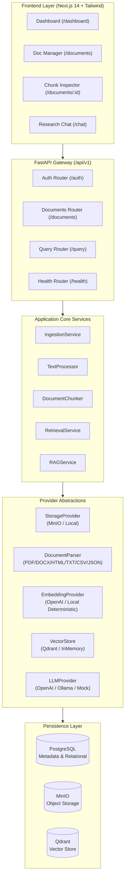

# GraphIntel Architecture (Phases 1–3)

## 1. System Overview

GraphIntel is an enterprise-grade Market Intelligence platform designed to ingest corporate filings, broker research, earnings call transcripts, and competitive datasets, perform sentence/paragraph-aware chunking, generate high-dimensional vector embeddings, and execute grounded vector-based RAG with verifiable source citations.

The platform intentionally implements **Phase 1 (Foundation & Architecture)**, **Phase 2 (Document Ingestion Pipeline)**, and **Phase 3 (Baseline RAG System)**, architected with modular abstractions that allow future expansion into **Phase 4 (Neo4j Knowledge Graph)** and beyond without architectural rewrites.



---

## 2. Decoupled Provider Abstractions

GraphIntel strictly adheres to the Dependency Inversion Principle. Core business logic never depends on concrete database, vector, or LLM vendors:

### 2.1 StorageProvider
```text
StorageProvider (ABC)
 ├── MinIOStorage       (S3-compatible, multipart, bucket isolation)
 └── LocalStorage       (Local filesystem fallback for dev & testing)
```

### 2.2 DocumentParser
```text
DocumentParser (ABC)
 ├── PDFParser          (PyMuPDF / fitz - page tracking)
 ├── DOCXParser         (python-docx - paragraphs & tables)
 ├── HTMLParser         (BeautifulSoup4 - clean semantic DOM)
 ├── TXTParser          (Robust encoding fallback UTF-8/Latin-1)
 ├── CSVParser          (pandas - tabular summaries & row batches)
 └── JSONParser         (Hierarchical key-value tree traversal)
```

### 2.3 EmbeddingProvider
```text
EmbeddingProvider (ABC)
 ├── OpenAIEmbeddingProvider           (text-embedding-3-small, batching)
 └── LocalDeterministicEmbeddingProvider (Hash/L2-normalized 384d, zero API key)
```

### 2.4 VectorStore
```text
VectorStore (ABC)
 ├── QdrantVectorStore  (Cosine metric, user_id payload filter isolation)
 └── InMemoryVectorStore (Cosine similarity engine for unit tests)
```

### 2.5 LLMProvider
```text
LLMProvider (ABC)
 ├── OpenAILLMProvider (gpt-4o-mini async chat completions)
 ├── OllamaLLMProvider  (Local llama3:8b via HTTP)
 └── MockLLMProvider    (Deterministic grounded response engine)
```

---

## 3. Future-Proof Design

To accommodate future phases seamlessly:
* **Phase 4 (Neo4j Knowledge Graph)**: Will implement `GraphStore` abstraction and entity extraction pipeline that consumes `DocumentChunk` records without altering the chunking database schema.
* **Phase 5 (Hybrid GraphRAG)**: `RetrievalService` will combine `VectorStore.search()` and `GraphStore.traverse()` into a unified hybrid ranking step.
* **Phase 10 (Kafka Asynchronous Scaling)**: `IngestionService._run_background_ingestion` is an isolated async task that directly maps to a Kafka Producer/Consumer worker model.
