# GraphIntel Document Ingestion Pipeline (Phase 2)

## 1. End-to-End Pipeline Workflow

The ingestion pipeline converts raw heterogeneous files into clean, searchable, vector-indexed chunks.

```mermaid
sequenceDiagram
    autonumber
    actor User
    participant API as FastAPI (/api/v1/documents)
    participant Storage as Object Storage (MinIO)
    participant DB as PostgreSQL (SQLAlchemy)
    participant Parser as DocumentParser (PyMuPDF, etc.)
    participant Chunker as DocumentChunker & TextProcessor
    participant Embed as EmbeddingProvider
    participant Vector as VectorStore (Qdrant)

    User->>API: Upload File (PDF, DOCX, TXT, HTML, CSV, JSON)
    API->>API: Validate MIME, size limit (50MB), filename sanitization
    API->>Storage: Upload raw binary to `users/{user_id}/documents/{doc_id}/`
    API->>DB: Create Document (UPLOADED), Version, and IngestionJob (PENDING)
    
    rect rgb(20, 30, 50)
        Note over API,DB: Ingestion Processing Stage
        API->>DB: Update Document (PROCESSING), Job (RUNNING)
        API->>Storage: Download raw bytes
        API->>Parser: Parse file bytes into ParsedSection list
        API->>Chunker: Clean text (NFKC, whitespace) and sentence-split into chunks
        API->>DB: Store DocumentChunk records
        API->>Embed: Generate batched embeddings (OpenAI / Local)
        API->>Vector: Upsert points with user_id and document metadata
        API->>DB: Update Document (COMPLETED), Job (COMPLETED)
    end

    API-->>User: Return Document details with chunk count
```



---

## 2. Parsers Implementation

| Format | Library | Strategy & Metadata Preserved |
|---|---|---|
| **PDF** | PyMuPDF (`fitz`) | Page-by-page extraction, page numbers, text blocks, document title. |
| **DOCX** | `python-docx` | Heading hierarchy, paragraph grouping, structured table text cells. |
| **HTML** | `BeautifulSoup4` | Strip scripts/styles, extract titles, H1-H3 headers, semantic text tags. |
| **TXT** | Python native | UTF-8, Latin-1, CP1252 auto-detect, double-newline paragraph segmentation. |
| **CSV** | `pandas` | Header summary, column names, row-by-row batch representation (`Column: Val`). |
| **JSON** | `json` | Structured key-value hierarchical summaries, array record batching. |

---

## 3. Text Processing & Chunking Strategy

### 3.1 Text Cleaning
Implemented in `app.services.text_processor.TextProcessor`:
* **Unicode Normalization**: NFKC normalization converts compatibility characters into canonical forms.
* **Control Character Filtering**: Removes non-printable characters and null bytes while preserving tabs and newlines.
* **Whitespace Normalization**: Collapses internal consecutive spaces on lines without destroying paragraph breaks.
* **Paragraph Preservation**: Collapses excessive linefeeds (3+) into standard double newlines (`\n\n`).

### 3.2 Chunking Architecture
Implemented in `app.services.chunker.DocumentChunker`:
* **Parameters**: `CHUNK_SIZE` (default 1000 tokens), `CHUNK_OVERLAP` (default 200 tokens).
* **Token Counting**: Uses `tiktoken` (`cl100k_base` encoding) with fallback character/word heuristic.
* **Paragraph & Sentence Splitting**: Splitting respects paragraph boundaries first, then sentence punctuation (`(?<=[.!?])\s+`), avoiding arbitrary mid-word breaks.
* **Chunk Schema**:
  ```json
  {
    "chunk_id": "9b1deb4d-3b7d-4bad-9bdd-2b0d7b3dcb6d",
    "document_id": "f81d4fae-7dec-11d0-a765-00a0c91e6bf6",
    "chunk_index": 0,
    "text": "Enterprise SaaS Market Intelligence Report 2026...",
    "page_number": 1,
    "section": "Page 1",
    "token_count": 86,
    "metadata": {
      "format": "pdf",
      "page": 1,
      "section": "Page 1"
    }
  }
  ```
